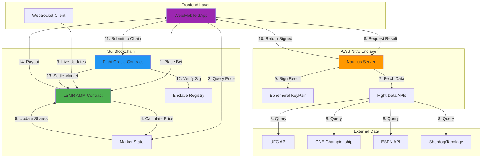
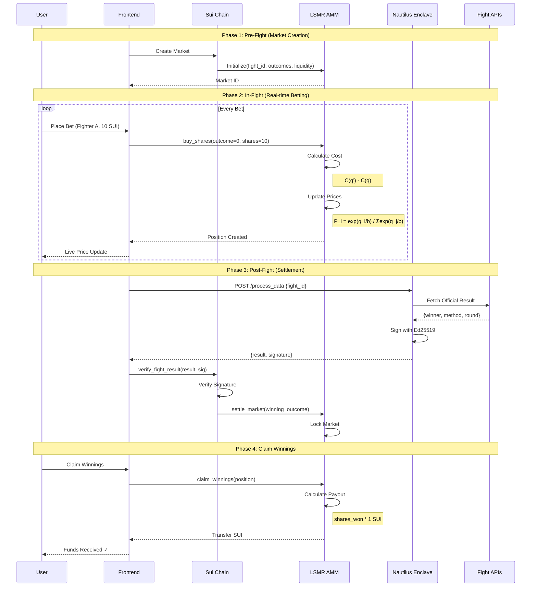
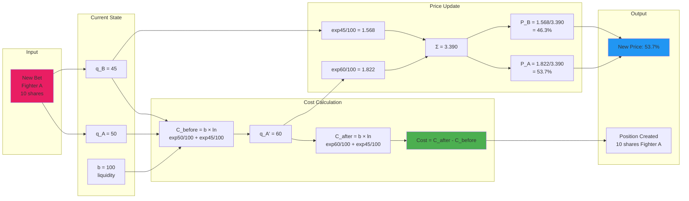
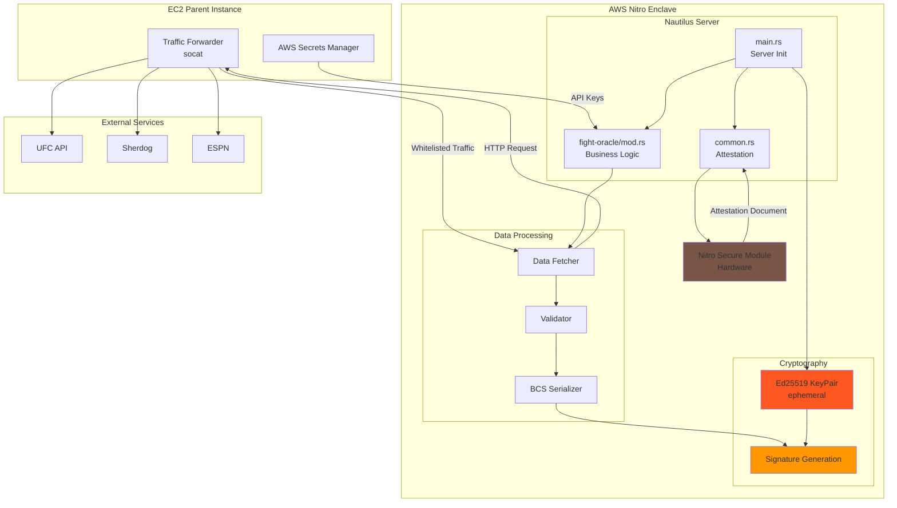
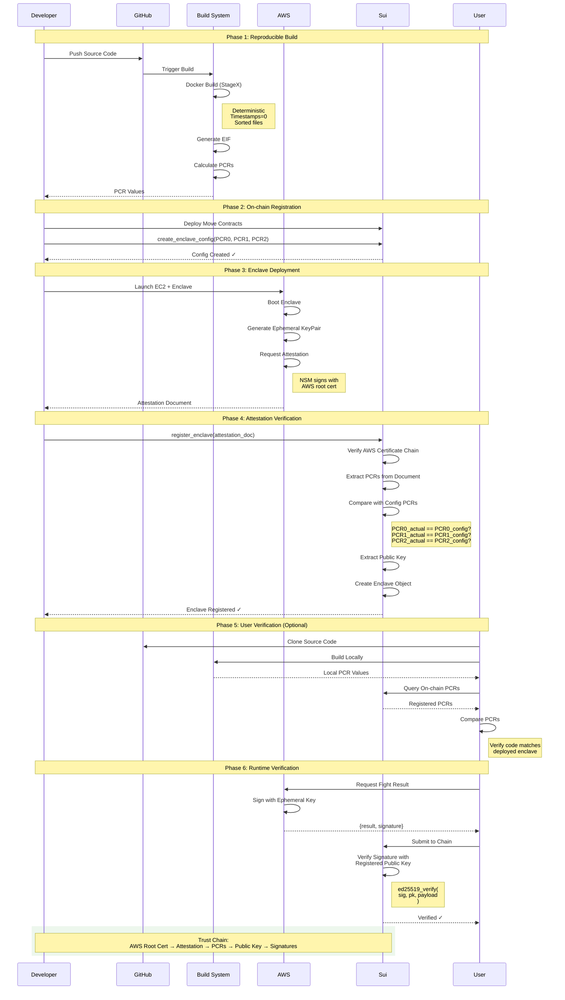
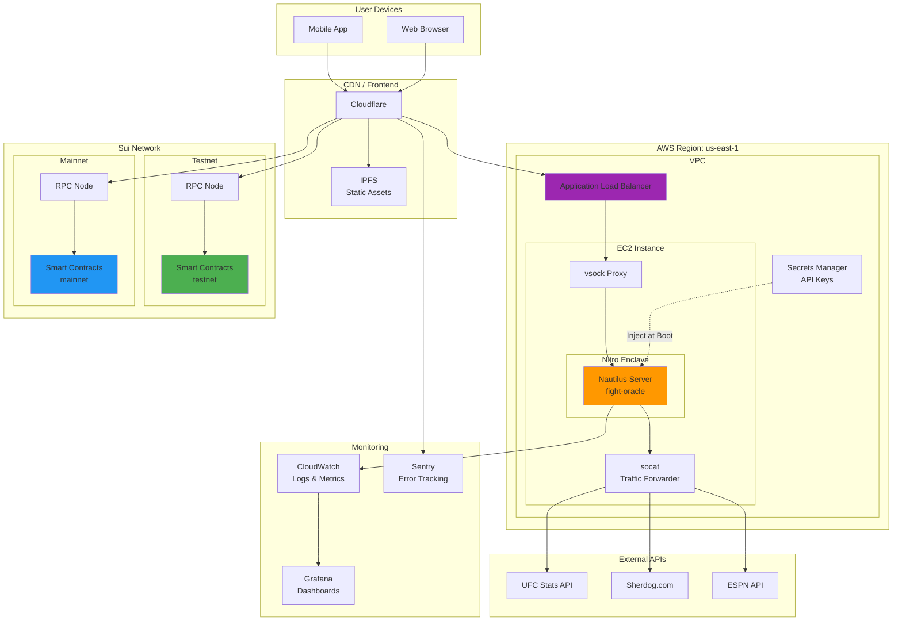
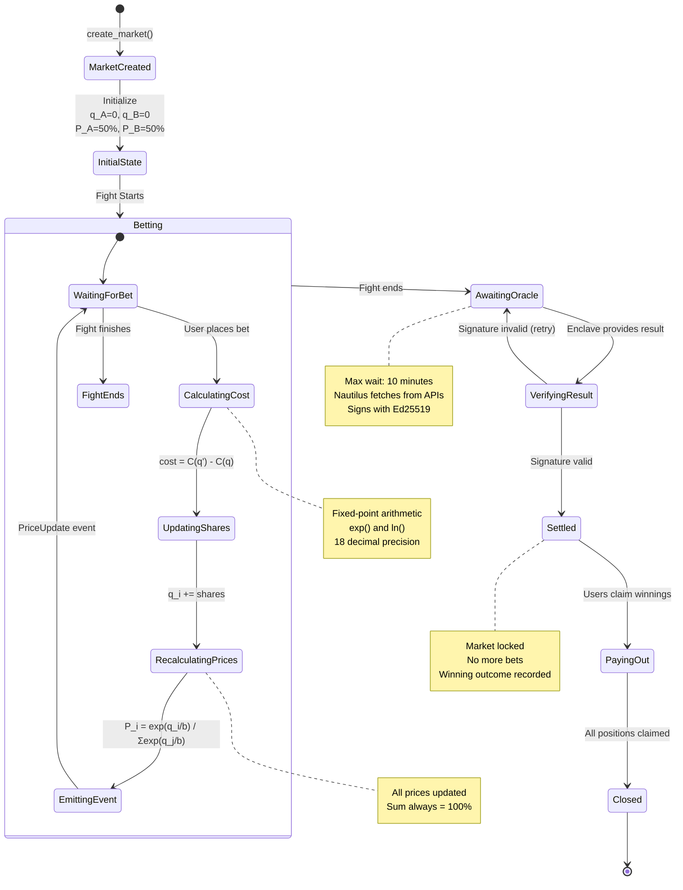
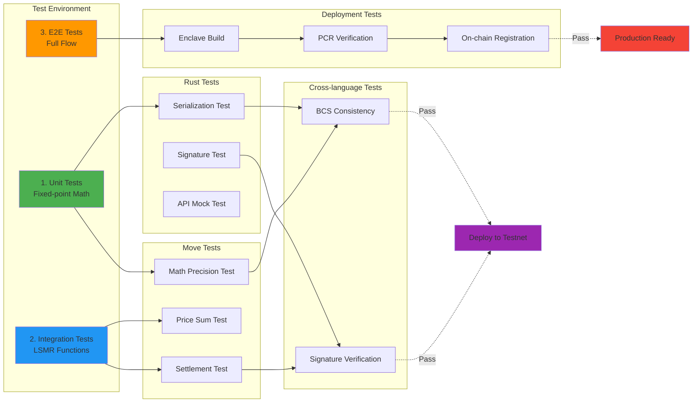

# In-fight AMM × Nautilus Architecture Diagrams

## 1. System Architecture Overview



## 2. Data Flow Diagram (Fight Lifecycle)



## 3. LSMR Price Calculation Flow



## 4. Nautilus Enclave Internal Architecture



## 5. Security Verification Flow



## 6. Deployment Architecture



## 7. Real-time Price Update State Machine



## 8. Integration Testing Flow



---

## Diagram Descriptions

### 1. System Architecture Overview

- Complete component relationships
- Data flow (14-step process)
- Responsibility boundaries for each layer

### 2. Data Flow Diagram

- Complete fight lifecycle
- 4 Phases: Pre-fight → In-fight → Post-fight → Claim
- Detailed processing at each step

### 3. LSMR Price Calculation Flow

- Concrete numerical example
- Cost function and price function calculations
- Real-time price update mechanism

### 4. Nautilus Enclave Internal Architecture

- Internal enclave structure
- Traffic forwarding mechanism
- Secret management and security

### 5. Security Verification Flow

- 6-phase trust chain construction
- Reproducible build verification with PCR values
- Independent verification procedure for users

### 6. Deployment Architecture

- AWS / Sui / CDN configuration
- Monitoring and logging systems
- Production infrastructure

### 7. Real-time Price Update State Machine

- State machine diagram
- State transitions from betting to settlement
- Processing at each state

### 8. Integration Testing Flow

- Test hierarchy
- Rust / Move / Cross-language tests
- Pre-deployment verification

---

## Key Features

### Technical Innovation

1. **First LSMR Implementation in Move**

   - Fixed-point arithmetic library
   - Efficient exponential/logarithm approximations
   - Reusable across Sui ecosystem

2. **Instant Settlement Oracle**

   - Settlement in < 10 minutes (industry-leading)
   - Cryptographically verifiable trust
   - Cost-efficient

3. **Live Prediction Market**
   - Real-time price updates during fights
   - World's first In-fight AMM
   - Withdraw & re-bet before next fight

### Security Guarantees

**Trust Chain:**

```
AWS Root Certificate
    → Attestation Document
        → PCR Values
            → Ephemeral Public Key
                → Signatures on Results
```

Each step is cryptographically verified, ensuring end-to-end trustworthiness.

### User Experience

| Phase          | Duration  | User Action                        |
| -------------- | --------- | ---------------------------------- |
| **Pre-fight**  | ~1 min    | Browse markets, place initial bets |
| **In-fight**   | 15-25 min | Watch live, adjust positions       |
| **Post-fight** | < 10 min  | Automatic settlement               |
| **Claim**      | Instant   | Withdraw winnings                  |

**Total: < 40 minutes** from fight start to funds in wallet

Compare to Polymarket: **3-7 days** for dispute resolution
